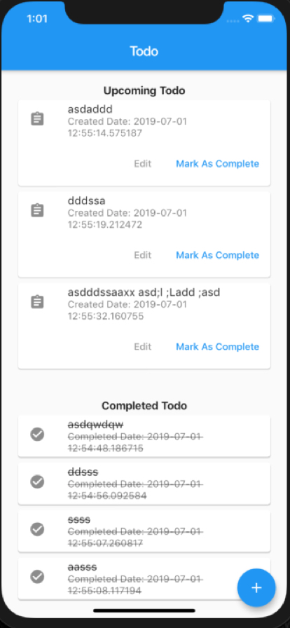

# flutter_todo
Flutter todo app with bloc

## Tasks

- [x] Implement Bloc package
- [x] Add todos
- [ ] Edit todos
- [x] Complete todos
- [ ] Widget tests 

## Preview



## How to run
``` bash
flutter pub get
flutter run
```
